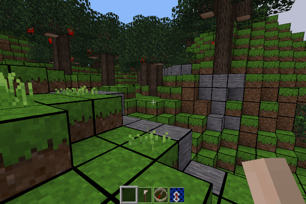

DefaultGrid Minetest Texture Pack
---------------------------------

By David G (kestral246@gmail.com)

Adds a grid overlay to the Minetest Game 5.0 default textures.

- Places grid over a large selection of default nodes.
- Note however that I have intentionally omitted trees, plants, liquids, tools, and irregular shapes like fences and ladders.
- Grid overlays are drawn at 32px for a finer grid, which means default textures will be scaled to 32px.
- Very small, uses override.txt and only a half-dozen grid image files.

